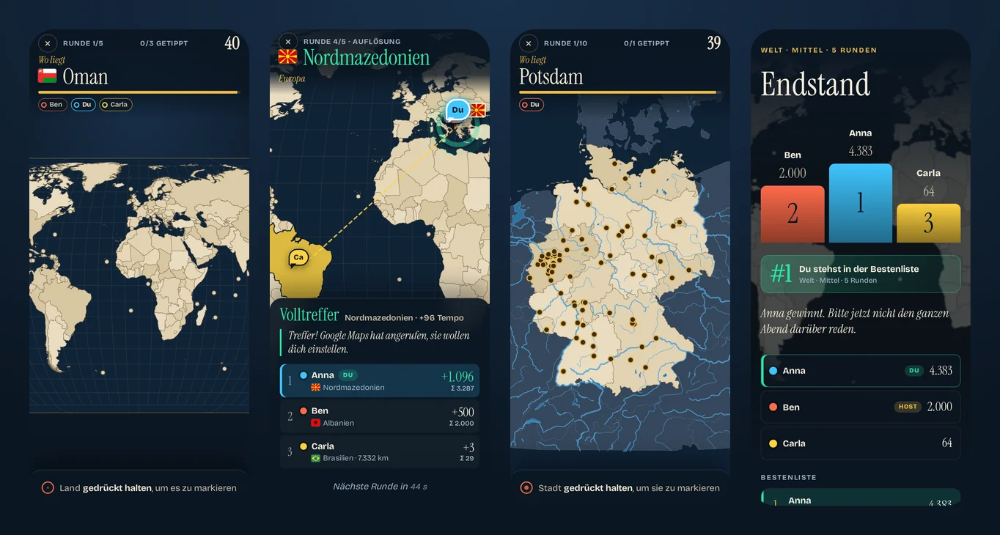
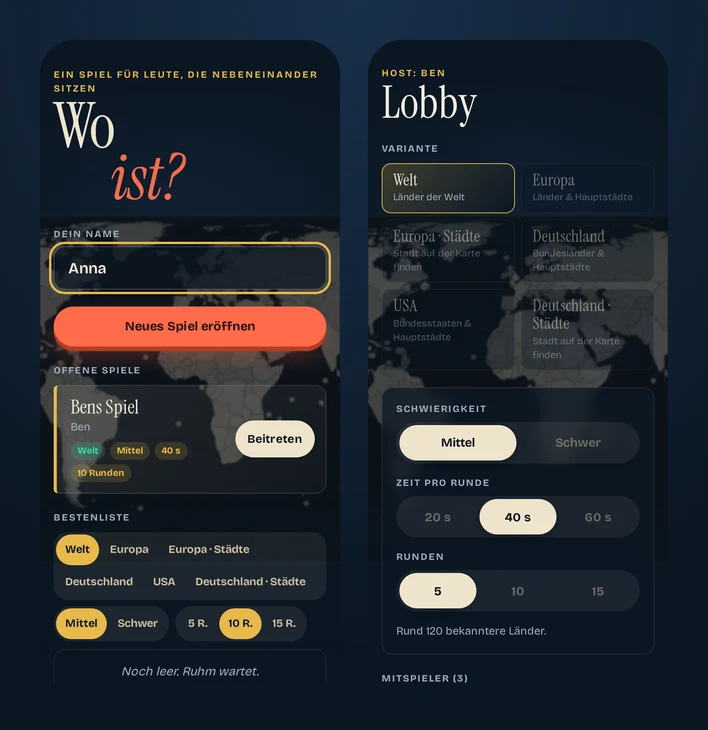

# Wo ist?

Ein Kartenquiz für Leute, die nebeneinander sitzen. Alle spielen auf dem eigenen Handy im selben Netz:
Ein Ort wird genannt, jeder tippt ihn auf der Karte an – danach gibt es Punkte, eine gemeinsame
Auflösung und einen frechen Kommentar.

- **Varianten:** Welt, Europa, Europa · Städte, Deutschland, Deutschland · Städte, USA – jeweils mit
  Schwierigkeitsstufen, in den schweren Stufen auch Hauptstadtfragen („Von welchem Land ist Bratislava die Hauptstadt?“).
- **Für Handys gemacht:** Karte verschieben und zoomen, Auswahl per Gedrückthalten + Bestätigen (kein
  versehentliches Antippen), Hoch- und Querformat, Fanghilfe für Kleinstaaten.
- **Mehrspieler im LAN:** Lobby eröffnen, die anderen sehen sie und steigen ein; auch allein spielbar.
- **Wertung nach Entfernung:** exakter Treffer, Nachbarland, knapp daneben … mit Tempobonus.
- **Orientierung:** Flüsse, Seen und Gebirgsrelief, in der Lobby einzeln abschaltbar.
- **Bestenliste**, Gesamtwertung über mehrere Spiele, Flaggen, über 250 Kommentare.
- **Läuft komplett offline im Intranet:** keine Konten, keine Cookies, keine externen Dienste, keine Datenbank.



<details>
<summary>Startseite und Lobby</summary>



</details>

## Selbst hosten mit Docker (empfohlen)

Voraussetzung: ein Rechner im Netz mit [Docker](https://docs.docker.com/get-docker/) – z. B. ein
Raspberry Pi (arm64), ein NAS oder ein normaler PC (amd64). Es wird kein Internetzugang zur Laufzeit benötigt.

```bash
git clone https://github.com/lspohn/wo-ist-quiz.git
cd wo-ist-quiz
docker compose up -d --build
```

Danach im Browser aufrufen: `http://<IP-des-Rechners>:7777` – alle Geräte im selben WLAN/LAN können mitspielen.
Die IP findest du z. B. mit `hostname -I` (Linux) oder in der Router-Oberfläche.

### Ohne Docker Compose

```bash
docker build -t wo-ist-quiz .
docker run -d --name wo-ist-quiz --restart unless-stopped \
  -p 7777:7777 -v wo-ist-data:/app/data wo-ist-quiz
```

### Tipp: Namen statt IP-Adresse

Statt `http://192.168.178.23:7777` lässt sich das Spiel meist über den Gerätenamen aufrufen:

| Netz | Adresse | Hinweis |
|---|---|---|
| **mDNS / Bonjour** (meist ohne Zutun) | `http://<gerätename>.local:7777` | z. B. `http://raspberrypi.local:7777`. Raspberry Pi OS und die meisten Linux-Systeme bringen das mit (Paket `avahi-daemon`). iPhone, Mac und Windows lösen `.local` zuverlässig auf, ältere Android-Geräte nicht immer – dann die nächste Zeile nutzen. |
| **FRITZ!Box** | `http://<gerätename>.fritz.box:7777` | z. B. `http://raspberrypi.fritz.box:7777`. Den Namen siehst und änderst du unter *Heimnetz → Netzwerk → Gerät bearbeiten*. Funktioniert auf allen Geräten, die die FRITZ!Box als DNS nutzen (Standard), also auch auf Android. |
| **Andere Router** | oft `http://<gerätename>.lan:7777` oder `.home` | Siehe Router-Handbuch. |

Weitere Tipps:

- In der FRITZ!Box beim Server *„Diesem Netzwerkgerät immer die gleiche IPv4-Adresse zuweisen“* aktivieren –
  dann bleibt auch die IP-Adresse stabil.
- Einen kurzen, gut tippbaren Gerätenamen wählen, z. B. `woist` → `http://woist.local:7777`.
- Mit Port `80` (`"80:7777"` in `docker-compose.yml`) entfällt die Portangabe: `http://woist.local`.
- Die Adresse als QR-Code ausdrucken oder auf dem Fernseher zeigen – dann ist man in Sekunden drin.

### Einstellungen

| Was | Wie |
|---|---|
| Anderer Port | in `docker-compose.yml` z. B. `"80:7777"` eintragen (links = Port im Netz) |
| Bestenliste behalten | liegt im Volume `wo-ist-data` (`/app/data/highscores.json`); übersteht Updates |
| Bestenliste zurücksetzen | `docker compose down` und `docker volume rm wo-ist-quiz_wo-ist-data` |
| Logs ansehen | `docker compose logs -f` |
| Gesundheitscheck | `http://<IP>:7777/health` liefert `ok` |

### Aktualisieren

```bash
git pull
docker compose up -d --build
```

### Hinweise fürs Netz

- **Nur im Intranet betreiben:** Das Spiel hat keine Anmeldung. Gib den Port nicht ins Internet frei.
- **WLAN mit Geräte-Isolation** (Gäste-WLAN, manche Schulnetze): Die Handys müssen den Server erreichen können.
  Notfalls einen eigenen Router/Hotspot nutzen.
- Handys im Standby verbinden sich automatisch wieder; das Display bleibt während einer Runde an (Wake Lock),
  wo der Browser das erlaubt.

## Ohne Docker (Node.js)

Benötigt Node.js ≥ 22.

```bash
npm ci --omit=dev
PORT=7777 node server/index.js
```

## Entwickeln

```bash
npm install
PORT=7788 npm start      # http://localhost:7788
npm test                 # Tests (node:test)
```

Die Karten- und Ortsdaten sind fertig gebaut eingecheckt. Neu erzeugen nur, wenn du Quellen änderst –
siehe `AGENTS.md` (Abschnitt Kartendaten) für die Build-Skripte.

## Lizenz

- **Code:** [GNU AGPL-3.0](LICENSE) – du darfst das Spiel frei nutzen, verändern und betreiben. Wer eine veränderte
  Fassung öffentlich als Website anbietet, muss deren Quellcode ebenfalls offenlegen.
- **Texte** (Kommentare, Oberflächentexte, Dokumentation): [CC BY 4.0](LICENSE-CONTENT.md).
- **Karten, Ortsdaten, Flaggen, Schriften:** Lizenzen der jeweiligen Quellen, siehe [QUELLEN.md](QUELLEN.md)
  (u. a. Natural Earth, Wikidata, GeoNames, flag-icons, Wikimedia Commons).

Copyright © 2026 Lucas Spohn
